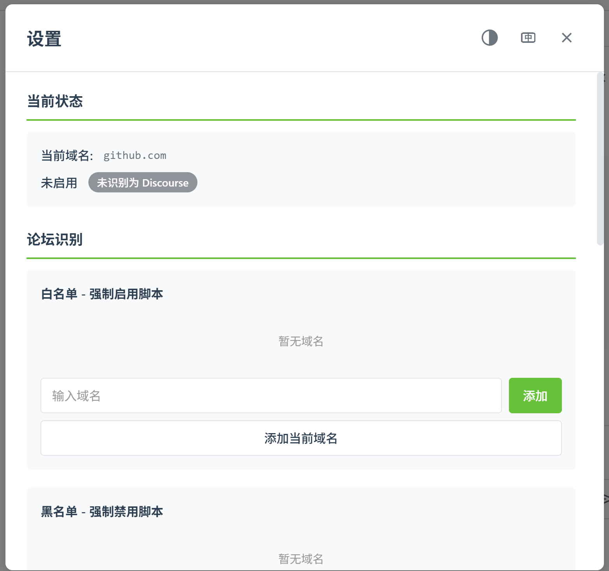

# Discourse New Tab

> Optimize link-click experience on Discourse forums: open topics and related pages in new tabs, highly customizable, auto-detects Discourse sites

English | [简体中文](README.md)

[](https://opensource.org/licenses/MIT)
[](https://greasyfork.org/en/scripts/552284-discourse-%E6%96%B0%E6%A0%87%E7%AD%BE%E9%A1%B5?locale_override=1)

## 📌 Table of Contents

- [Why You Need This Script](#why-you-need-this-script)
- [What Makes It Different](#what-makes-it-different)
- [Features](#features)
- [Installation](#installation)
- [Usage](#usage)
- [Detailed Rules](#detailed-rules)
- [Settings Preview](#settings-preview)
- [FAQ](#faq)
- [Future Plans](#future-plans)
- [Contributing](#contributing)
- [License](#license)

## Why You Need This Script

Have you ever encountered these issues?

- Used to opening topics in new tabs, but don't want to load and switch within the same page?
- Tired of manually holding Ctrl or middle-clicking links every time you browse forums?
- Asked for a script that automatically opens links in new tabs, only to be told "it's not necessary"?
- Tried other similar scripts, but they always felt off?

Then give this script a try.

## What Makes It Different

### 1. Auto-Detection, One-Time Configuration

Automatically detects whether the current page is a Discourse forum and activates accordingly. Configure once, consistent experience, one script handles (almost) all forums. Whitelist and blacklist features are also provided as fallback for smart detection.

> **Note:** Forums that cannot be automatically detected are likely highly customized. Force-enabling via whitelist may cause some rules to fail or behave incorrectly.

### 2. Attention to Detail

Many new-tab scripts either only work when clicking links on the homepage (failing on search pages), or open ALL posts in new tabs - even switching between replies in the same topic opens a new page.

This script optimizes these details to ensure a smooth and intuitive browsing experience at all times.

### 3. Beyond Just Topics

This script also handles user profiles, attachments, popups, and more. If you don't like a particular setting and want to switch between original tab/new tab behavior, you can modify it anytime in the settings interface to customize your browsing experience.

### 4. Beautiful Settings Interface

The settings interface is aesthetically pleasing, supports dark mode and language switching, and allows one-click addition of current domain to whitelist/blacklist. Although you might not open the settings interface for ages, the functionality is comprehensive.

> **Note:** The script enables all configuration switches by default, which represents the author's preferred browsing style. Therefore, when enabled, some options open in new tabs while others use native behavior - this is not chaotic design, it's a feature QAQ. The effect of each option is clearly documented and should not cause confusion.

## Features

- ✨ **Smart Detection** - Automatically detects Discourse forums, no manual configuration needed
- 🛡️ **Whitelist/Blacklist** - Flexible domain management with force enable/disable options
- 🎯 **Precise Control** - Fine-grained control over different scenarios: topics, user profiles, attachments, popups, sidebars
- 🔧 **Highly Customizable** - Each rule can be independently enabled or disabled
- 🎨 **Beautiful Interface** - Settings interface supports light/dark/auto night mode
- 🌍 **Multi-Language** - Supports Chinese and English interface switching
- ⚡ **Ultimate Performance** - No perceptible difference in browsing experience before and after installation

## Installation

### Prerequisites

First, install a userscript manager:

- [Tampermonkey](https://www.tampermonkey.net/) (Recommended, supports Chrome, Firefox, Edge, Safari, Opera)
- [Violentmonkey](https://violentmonkey.github.io/) (Supports Chrome, Firefox, Edge)
- [Greasemonkey](https://www.greasespot.net/) (Firefox only)

### Install Script

After installing the userscript manager, click one of the links below to install this script:

- **Greasy Fork (Recommended)**: [Click to Install](https://greasyfork.org/en/scripts/552284-discourse-%E6%96%B0%E6%A0%87%E7%AD%BE%E9%A1%B5?locale_override=1)
- **GitHub**: [Click to Install](https://github.com/selaky/discourse-new-tab/releases/latest/download/discourse-new-tab.user.js)

## Usage

1. After installing the script, visit any Discourse forum and it will automatically take effect
2. Click the userscript manager icon in your browser toolbar, select "Settings" to enter the settings interface
3. In the settings interface, you can:
   - View the activation status of the current domain
   - Manage whitelist and blacklist
   - Customize various navigation rules

## Detailed Rules

All rules can be independently enabled or disabled in the settings interface. The following describes the behavior when rules are **enabled**:

### Topic Rules

- Open topics in **new tab** when clicking from any page
- Open other links in **new tab** when inside a topic
- If the target link is the same topic (floor navigation), **keep native behavior**

### User Profile Rules

- Open user profiles in **new tab** when clicking from any page
- Open other links in **new tab** when inside a user profile
- If the target link is the same user's profile, **keep native behavior**

### Attachment Rules

- When opening images and other attachments, **keep native behavior**

### Popup Rules

#### User Card

- Links in the user card (shown when clicking any user avatar) open in **new tab**

#### User Menu

- Links in the user menu (shown when clicking your own avatar in top-right) open in **new tab**
- When clicking category tabs to switch content, **keep native behavior**
- When clicking the already-selected category icon again, open in **new tab**

#### Search Box

- Links in search results within the search box open in **new tab**

### Sidebar Rules

- Outside topics: **keep native behavior**
- Inside topics: open in **new tab**

> **Rule Priority:** If a link matches multiple rules, the later rule takes precedence.

## Settings Preview



Settings interface features:

- 📊 **Current Domain Status** - Real-time display of script activation status and reason for current site
- ✅ **Whitelist Management** - Manually add domains to force-enable the script
- 🚫 **Blacklist Management** - Manually add domains to force-disable the script
- 🔄 **One-Click Add Current Domain** - Quickly add the currently visited site to whitelist or blacklist
- ⚙️ **Navigation Rules Configuration** - Independent switches for all rules to meet personalized needs
- 🐛 **Debug Mode** - Enable to output detailed debugging information in the console for troubleshooting
- 🎨 **Theme Switching** - Light/Dark/Auto mode
- 🌐 **Language Switching** - 中文/English

## FAQ

### Q: The script doesn't work on my favorite forum?

A: First check if the forum is actually a Discourse forum. If it is but the script doesn't auto-detect it, you can manually add the domain to the whitelist in settings.

### Q: How do I tell if a forum is Discourse?

A: Discourse forums typically have these characteristics:
- URL format like `https://domain/t/topic/numbers` or `https://domain/c/category-name/numbers`
- Usually has "Powered by Discourse" at the page footer
- Check the forum's "About" page to see what forum software it uses

### Q: Why are some highly customized forums not supported?

A: Some forums have deeply customized Discourse, changing the original DOM structure and behavior logic, which may cause script rules to fail or behave unexpectedly. In such cases, it's recommended to add the domain to the blacklist.

### Q: Will the script affect browsing speed?

A: No. The script is performance-optimized and automatically stops core functionality on non-Discourse forums, keeping only the settings menu entry, with virtually no impact on browsing experience.

### Q: After disabling a rule, how will links open?

A: For rules set to "keep native behavior" by default, they will change to "open in new tab" when disabled. Other rules return to Discourse's native behavior when disabled.

## Future Plans

The script is currently quite mature, with functionality covering most common use cases. If there are no obvious bugs or missing features, there may not be frequent updates.

The author is a student and can only perform maintenance periodically. If you encounter issues or have new feature suggestions, please submit an [Issue](https://github.com/selaky/discourse-new-tab/issues).

If you'd like to contribute to this project, Pull Requests are very welcome!

## Contributing

Contributions of all forms are welcome:

- 🐛 [Report Bugs](https://github.com/selaky/discourse-new-tab/issues/new?labels=bug)
- 💡 [Suggest New Features](https://github.com/selaky/discourse-new-tab/issues/new?labels=enhancement)
- 📝 Improve Documentation
- 🌍 Help with Translation
- 💻 Submit Code

### Development Guide

```bash
# Clone repository
git clone https://github.com/selaky/discourse-new-tab.git
cd discourse-new-tab

# Install dependencies
npm install

# Development mode (watch for file changes and auto-build)
npm run dev

# Build production version
npm run build

# Clean build artifacts
npm run clean
```

The built script is located at `dist/discourse-new-tab.user.js` and can be installed directly in your userscript manager for testing.

### Code Standards

- Modular development, maintain high cohesion and low coupling
- Focus on performance, avoid unnecessary DOM operations
- Unified navigation handling logic
- Detailed code comments

## Acknowledgements

Thanks to all users who use and support this project!

## License

This project is licensed under the [MIT](LICENSE) License.

---

<div align="center">

**[⬆ Back to Top](#discourse-new-tab)**

If this project helps you, please give it a ⭐️ !

</div>
